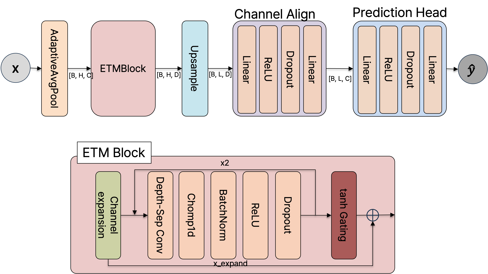

# EfficientTCN: Efficient Temporal Convolutional Network for Time Series Forecasting

## 🚀 Overview
EfficientTCN is a novel architecture for **time series forecasting**, designed to improve both **efficiency** and **predictive performance**.  
Built upon the Temporal Convolutional Network (TCN), it integrates **advanced gating mechanisms**, **view-based feature fusion**, and **uncertainty estimation**, making it suitable for real-world sequential data analysis.

---

## 🎯 Key Features

- **Efficient Convolutions**
  - Depthwise + Pointwise Separable Conv1d to reduce parameters and improve efficiency.

- **Gating Mechanisms**
  - Multiple gating strategies to capture different temporal dynamics:
    - **ChannelSEGate**: Emphasizes important channels.
    - **TemporalSEGate**: Highlights key timesteps.
    - **SpikeGate**: Focuses on sudden spikes or changes.
    - **GLUGate**: Gated Linear Units for dynamic flow control.

- **View-based Multi-scale Fusion**
  - Processes input with different kernel sizes & dilation rates (views).
  - Fuses multiple representations through a 1×1 convolution.

- **Downsampling & Upsampling**
  - Compresses sequence length for efficiency.
  - Restores temporal resolution with upsampling, preserving global & local context.

- **Uncertainty-aware Predictions**
  - Predicts both **future values** and their **uncertainty** (via Softplus-based variance estimation).

---

## 🏗️ Architecture

## 🔧 Installation
pip install -r requirements.txt

## 📘 Usage
If you want to run all data

`sh run_main.sh [Model]`

else

`sh scripts/Total/etth1.sh [Model]`
